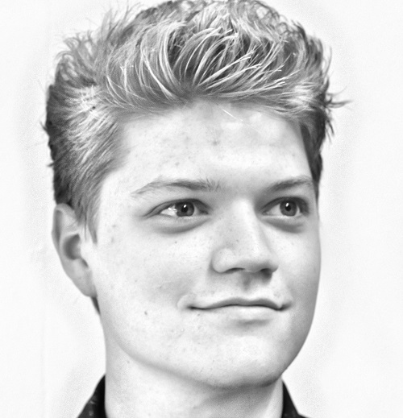

# Thank you for visiting!

My name is Jos Feenstra, a second year Msc Geomatics Student at the TU Delft. Allow me to tell a little bit about myself.

I Started out at the TU Delft as a [Bsc Student Architecture & The build Environment][1]. The creativity and spatial puzzles present in architecture made me fall in love with the field. And while Architecture's lessons are still invaluable to me, I increasingly became aware of a certain imbalance. I felt a need for a more a more solid foundation to build upon, something orderly to counterbalance the chaotic nature which is inevitably part of any creative endeavour.

Ironically, the virtual became this solid ground. During the excellent [Minor Programming][2] at the University of Amsterdam, I reconnected with something I used to do, many years ago: coding. C, python, sorting algorithms, everything I learned there just fit like a glove in a way the principles of architecture never could. I knew instantly that, wherever life would take me, it needed to be within this field.

This realization fired up a ton of dedication and focus, which in turn opened up amazing opportunities.
I landed my first serious job as software developer at [Sfered][3] three years ago, were I've been working ever since.
After finishing my bachelors degree in Architecture, I switched over to the field of [Geomatics][4], to continue my development as a proper programmer, to keep expanding my knowledge and skills in computational geometry, and to discover the fascintating world of Geodesy. Which brings me to where I am right now. I will start working on my thesis in September 2021, and I plan to finish that within that year. 

I enjoy tackling problems which necessitate a wholistic approach. I am not the best designer in the entire world, nor the best programmer, but I have discovered that I can mean a lot in situations where both mindsets are needed within one skull. I get my strength from fascination in abstract and unortodox ideas, mixing them, experimenting with them, and then turning those vague concepts into concrete, tangible products which really mean something. This mixing of ideas has lead me to do things like using geomatics-related algoritms in order to create [art][7], using game-engines to build [geomatics][5] applications, and using AI to help me design [posters][6]. 

If you have read this far, thank you! I would love to get in contact via one of the channels below. Any method is fine, though I prefer email. Looking forward hearing from you!  

[1]: <http://josfeenstra.nl/#architecture> "link to architecture"
[2]: <http://josfeenstra.nl/#minor> "link to minor"
[3]: <http://josfeenstra.nl/#sfered> "link to sfered"
[4]: <http://josfeenstra.nl/#geomatics> "link to geomatics"
[5]: <http://josfeenstra.nl/#synthesis> "synthesis project"
[6]: <http://josfeenstra.nl/#groover> "groover"

[7]: <http://josfeenstra.nl/#demo> "Demo"